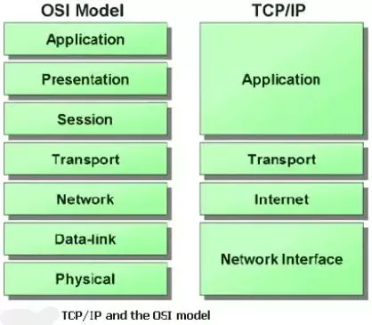

> Packet 에 대한 상세한 이해는 아래 문서로 보완이 필요합니다.
> https://www.baeldung.com/cs/networking-packet-fragment-frame-datagram-segment

---
## Network Model

**Physical**
- 전기적 신호로 변환하여 전송
- LAN 카드, Hub 등 물리적 장치에 연결되어 있는 장비들 간의 통신이 가능

**Data Link**
- 네트워크 장비 사이의 신호를 주고받는 규칙을 정하는 층
- MAC 주소: LAN 카드에 할당된 고유 주소
- Ethernet header: MAC 주소를 담고 있음
- Switch: MAC 주소를 기반으로 패킷을 전송. 같은 switch 에 연결된 장비들끼리 통신이 가능함.

**Network**
- 서로 다른 Data link 계층 간의 통신을 담당
- IP 주소: 네트워크 장비에 할당된 주소

**Transport**
- 3 계층에서의 전송이 잘 되었는지 확인
- TCP 프로토콜: 연결형 통신, 신뢰성 있는 데이터 전송
- UDP 프로토콜: 비연결형 통신, 효율적인 데이터 전송

## Firewalls in OSI model

### Packet filtering
- OSI 3, 4 계층에서 동작
- 패킷의 header 에 실린 ip address, port number 등을 검색하고 통제

### Application gateway
- OSI 7 계층에서 동작
- 패킷의 data 영역까지 체크

### Circuit gateway
- OSI 5, 6, 7 계층에서 동작

### Stateful inspection
- OSI 3 계층에서 동작

### Hybrid
- 대부분의 방화벽은 Packet filtering + Application gateway 방식을 혼합하여 사용한다.

## Iptables
- 다루는 정보가 ip 라는 점에서 packet filtering 에 해당
- 하지만 어플리케이션 이기에 7계층에서 동작하는 application gateway 와 비슷한 역할을 함
