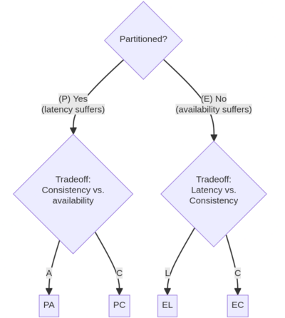

# PACELC-Theorem
## CAP 이론의 연장선

- network partition 발생 시 consistency (PC) vs availability (PA) 중에 선택해야 함
- 하지만 partition 이 발생하지 않는다면(else) latency (EL) vs consistency (EC) 중 선택해야 함
- 실질적으로 network partition 을 사용하는 경우가 별로 없어서 해당 이론이 더 주목을 받음.

## Else 
### Latency
정상 상황에서 일관성 대신 Latency 를 고려하는 것 => Fast read, Fast write 에 초점
### Consistency
정상 상황에서 모든 노드의 데이터 일관성에 주목하는 것 => 당연히 write 연산을 대기해야 하므로 latency 가 늘어남.