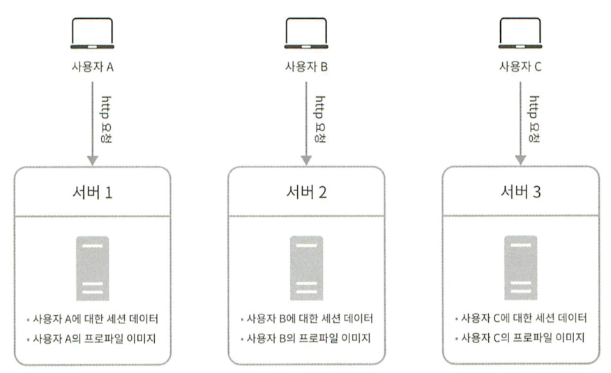

## 1장 사용자 수에 따른 규모 확장성

### 데이터베이스

**어떤 데이터베이스를 사용할 것인가?** 

비-관계형 데이터베이스가 바람직한 선택인 경우

- 아주 낮은 응답 지연시간(latency)가 요구됨
- 다루는 데이터가 비정형이라 관계형 데이터가 아님
- 데이터(JSON,YAML,XML등)를 직렬화하거나 역직렬화 할수 있기만 하면 됨
- 아주 많은 양의 데이터를 저장할 필요가 있음
    - 직렬화와 역직렬화
        
        ✅ 직렬화 : 객체들의 데이터를 연속적인 데이터(스트림)로 변형하여 전송 가능한 형태로 만드는 것
        
        ✅ 역직렬화 : 직렬화된 데이터를 다시 객체의 형태로 만드는 것
        
        [· JAVA 직렬화(Serialization)과 역직렬화(Deserialization)](https://inkyu-yoon.github.io/docs/Language/Java/Serialization)
        

### 수직적 규모 확장 VS 수평적 규모 확장

- 수직적 규모 확장: 서버에 고사양 자원(더 좋은 CPU, 더 많은 RAM등)을 추가하는 행위. 스케일업(scale up)이라고 부름
- 수평적 규모 확장: 더 많은 서버를 추가하여 성능을 개선하는 행위. 스케일 아웃이라고 부름

서버로 유입되는 트래픽의 양이 적을 때는 수직적 확장이 좋은 선택이며, 이 방법의 가장 큰 장점은 단순함이다. 그러나 불행하게도 이 방법에는 몇가지 심각한 단점이 있다

- 수직적 규모 확장에는 한계가 있다. 한 대의 서버에 CPU나 메모리를 무한대로 증설할 방법은 없다.
- 수직적 규모 확장법에는 장애에 대한 자동복구 방안이나 다중화 방안을 제시하지 않는다. 서버에 장애가 발생하면 웹사이트/앱은 완전히 중단된다.

웹 서버가 다운되거나 너무 많은 사용자가 웹 서버가 한계 상황에 도달하게 되면 응답 속도가 느려지거나 서버 접속이 불가능해질 수 도 있다. 이런 문제를 해결하는 데는 부하 분산기 또는 로드 밸런서를 도입하는 것이 최선이다.

**로드 밸런서**

: 부하 분산 집합에 속한 웹 서버들에게 트래픽 부하를 고르게 분산하는 역할을 한다.

사설 IP주소: 같은 네트워크에 속한 서버 사이의 통신에만 쓰일 수 있는 IP주소로, 인터넷을 통해서는 접속할 수 없다. 로드 밸런서는 웹 서버와 통신하기 위해 바로 이 사설 주소를 이용한다. 

### 무상태(stateless)웹 계층

상태 정보(사용자 세션 데이터와 같은)를 웹 계층에서 제거하기 위해 상태 정보를 관계형 데이터베이스나 NoSQL같은 지속성 저장소에 보고나하고, 필요할 때 가져오도록 함. 이렇게 구성된 웹 계층을 무상태 웹 계층이라고 부른다. 

**상태정보 의존적인 아키텍처**

사용자 A의 세션 정보나 프로파일 이미지 같은 상태 정보는 서버 1에 저장된다. 사용자 A를 인증하기 위해 HTTP요청은 반드시 서버 1로 전송되어야 한다. 요청이 서버 2로 저장되면 인증은 실패하게 되는데, 서버 2에는 사용자 A에 관한 데이터를 보관하고 있지 않기 때문이다.

문제는 같은 클라이언트로부터의 요청은 항상 같은 서버로 전송되어야 한다는 것이다. 대부분의 로드밸런서가 이를 지원하기 위해 고정 세션(sticky session)이라는 기능을 제공하고 있는데, 이는 로드 밸런서에 부담을 준다. 게다가 로드 밸런서 뒷단에 서버를 추가하거나 제거하기도 까다로워진다. 이들 서버의 장애를 처리하기도 복잡해진다. 

- 고정 세션(sticky session)
    
    Sticky Session이란 특정 세션의 요청을 처음 처리한 서버로만 전송하는 것을 의미
    
    [Sticky Session](https://kchanguk.tistory.com/146)
    
    [Configure sticky sessions for your Classic Load Balancer - Elastic Load Balancing](https://docs.aws.amazon.com/ko_kr/elasticloadbalancing/latest/classic/elb-sticky-sessions.html)
    

### 데이터 센터

다중 데이터센터 아키텍처를 만들려면 몇 가지 기술적 난제를 해결해야한다.

- 트래픽 우회: 올바른 데이터 센터로 트래픽을 보내는 효과적인 방법을 찾아야 한다. GeoDNS는 사용자에게서 가장 가까운 데이터센터로 트래픽을 보낼 수 있도록 한다.
- 데이터 동기화: 데이터 센터마다 별도의 데이터베이스를 사용하고 있는 상황이라면, 장애가 자동으로 복구되어 트래픽이 다른 데이터베이스로 우회된다 해도, 해당 데이터센터에는 찾는 데이터가 없을 수 있다. 이런 상황을 막는 보편적 전략은 데이터를 여러 데이터센터에 걸쳐 다중화 하는 것이다.

### 메시지 큐

:메시지의 무손실(durability, 즉 메시지 큐에 일단 보관된 메시지는 소비자가 꺼낼 때까지 안전히 보관된다는 특성)을 보장하는, 비동기 통신을 지원하는 컴포넌트다.

생산자 또는 발행자라고 불리는 입력 서비스가 메시지를 만들어 메시지 큐에 발행한다. 큐에는 보통 소비자 혹은 구독자라 불리는 서비스 혹은 서버가 연결되어 있는데, 메시지를 받아 그에 맞는 동작을 수행하는 역할을 한다.

### 데이터베이스의 규모확장

**수평적 확장**

데이터베이스의 수평적 확장은 샤딩(sharding)이라고도 부른다. 샤딩은 데규모 데이터베이스를 샤드라고 부르는 작은 단위로 분할하는 기술을 일컫는다. 모든 샤드는 같은 스키마를 쓰지만 샤드에 보관되는 데이터 사이에는 중복이 없다. 

### 백만 사용자, 그리고 그 이상

시스템 규모 확장을 위해 살펴본 기법들

- 웹 계층은 무상태 계층으로
- 모든 계층에 다중화 도입
- 가능한 한 많은 데이터를 캐시할 것
- 여러 데이터 센터를 지원할 것
- 정적 콘텐츠는 CDN을 통해 서비스 할 것
- 데이터 계층은 샤딩을 통해 그 규모를 확장할 것
- 각 계층은 독립적 서비스로 분할할 것
- 시스템을 지속적으로 모니터링하고, 자동화 도구들을 활용 할 것

- 🛋️참고 주석
    
    캐시 전략에 대한 비교 연구 결과
    
    [Caching Strategies and How to Choose the Right One](https://codeahoy.com/2017/08/11/caching-strategies-and-how-to-choose-the-right-one/)
    
    단일 장애지점(Single Point Of Failure)
    
    [단일 장애 지점이란 무엇인가요? (SPOF)](https://velog.io/@sweet_sumin/단일-장애-지점이란-무엇인가요-SPOF)
    
    넷플릭스의 데이터 다중화 (Active-Active for Multi-Regional Resiliency By Netflix 번역)
    
    [Active-Active for Multi-Regional Resiliency By Netflix [번역]](https://minkukjo.github.io/cs/2022/07/17/netflix/)
    

---

## 2장 개략적인 규모 추정

: 보편적으로 통용되는 성능 수치상에서 사고 실험을 행하여 추정치를 계산하는 행위로서, 어떤 설계가 요구사항에 부합할 것인지 보기 위한 것

- 예제: 트위터 QPS와 저장소 요구량 추정
    
    QPS(Query Per Seconds): Server가 초당 실행하는 Query 총량으로 조회량 /초 는 한서버가 1초에 해당하는 조회 횟수로 특정한 조회 서버가 규정된 시간 내에 처리하는 조회량이 얼마인지에 대한 평가 기준
    
    **[ 가정 ]**
    
    - **월간 능동 사용자는 3억 명**
    - **50%의 사용자가 트위터를 매일 사용한다.**
    - **평균적으로 각 사용자는 매일 2건의 트윗을 올린다.**
    - **미디어를 포함하는 트윗은 10% 정도이다.**
    - **데이터는 5년간 보관된다.**
    
    **[ 추정 ]**
    
    - **월간 능동 사용자는 3억명이다.**
    - **50%의 사용자가 트위터를 매일 사용한다.**
    - **3억 x 50% = 1.5억명**
    
    **[ QPS(Query Per Second) 추정치 ]**
    
    - 평균적으로 각 사용자는 매일 2건의 트윗을 올린다
    - QPS = 1.5억 x 2 트윗 / 24시간 / 1분(3600초) = 약 3500
    - 최대 QPS = 3500 x 2 = 약 7000
    
    최대 QPS를 추정할 때는 고려사항이 있습니다. 최대 QPS는 시스템에 부하를 가할 수 있는 특정 상황을 고려하여 계산되는데 예를 들어, 특정 시간대에 트윗이 급증할 수 있기 때문에 여분의 처리 능력이 필요할 수 있습니다. 따라서 최대 QPS를 추정할 때는 적정한 여유 공간을 더해 계산합니다. 이 경우 2배로 고려하여 약 7000의 최대 QPS를 도출
    
    **[ 미디어 저장을 위한 저장소 요구량 ]**
    
    - 평균 트윗 크기 (avg)
        - tweet_id에 64바이트
        - 텍스트에 140바이트
        - 미디어에 1MB
    - 미디어를 포함하는 트윗은 10% 정도
        - 1.5억 x 2 x 10% x 1MB = 30TB/일
    - 데이터는 5년간 보관된다.
        - 30TB x 365 x 5년 = 약 55PB

---

## 3장 시스템 설계 면접 공략법

### 효과적 면접을 위한 4단계 접근법

**1단계 문제 이해 및 설계 범위 확정**

면접은 퀴즈쇼가 아니며, 정답 따위는 없다는 걸 상기하자. 그러니 바로 답부터 들이밀지 말라. 속도를 늦춰라. 깊이 생각하고 질문하여 요구사항과 가정들을 분명히 하라. 이 단계의 중요성은 강조하고 또 강조해도 모자람이 없다.

엔지니어가 가져야 할 가장 중요한 기술 중 하나는 올바른 질문을 하는 것, 적절한 가정을 하는 것, 그리고 시스템 구축에 필요한 정보를 모으는 것이다. 

**2단계 개략적인 설계안 제시 및 동의 구하기**

**3단계 상세 설계**

**4단계 마무리**

**해야할 것**

- 질문을 통해 확인하라. 스스로 내린 가정이 옳다 믿고 진행하지 말라.
- 문제의 요구사항을 이해하라.
- 정답이나 최선의 ㄷ바안 같은 것은 없다는 점을 명심하라. 스타트업을 위한 설계안과 수백만 사용자를 지원해야 하는 중견 기업을 위한 설계안이 같을 리 없다. 요구사항을 정화하게 이해했는지 다시 확인하라
- 면접관이 여러분의 사고흐름을 이해할 수 있도록 하라. 면접관과 소통하라.
- 가능하다면 여러 해법을 함께 제시하라.
- 개략적 설계에 면접관이 동의하면, 각 컴포넌트의 세부사항을 설명하기 시작하라. 가장 중요한 컴포넌트부터 진행하라.
- 면접관의 아이디어를 이끌어 내라. 좋은 면접관은 여러분과 같은 팀원처럼 협력한다.
- 포기하지 말라.

**하지 말아야할 것**

- 전형적인 면접 문제들에도 대비하지 않은 상태에서 면접장에 가지 말라.
- 요구사항이나 가정들을 분명히 하지 않은 상태에서 설계를 제시하지 말라.
- 처음부터 특정 컴포넌트의 세부사항을 너무 깊이 설명하지 말라. 개략적 설계를 마친 뒤에 세부사항으로 나아가라.
- 진행 중에 막혔다면, 힌트를 청하기를 주저하지 말라.
- 다시 말하지만, 소통을 주저하지 말라. 침묵 속에 설계를 진행하지 말라.
- 설계안을 내놓는 순간 면접이 끝난다고 생각하지 말라. 면접관이 끝났다고 말하기 전까지는 끝난 것이 아니다. 의견을 일찍, 그리고 자주 구하라