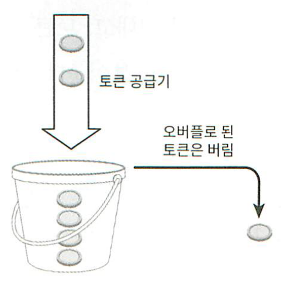
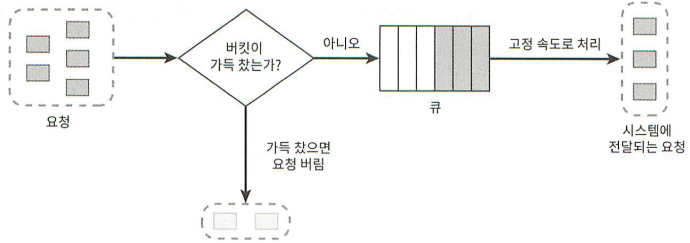
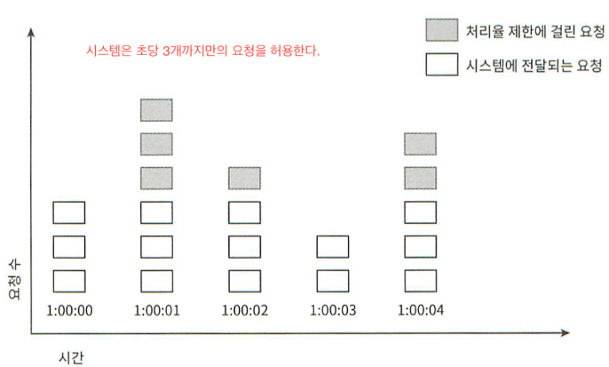
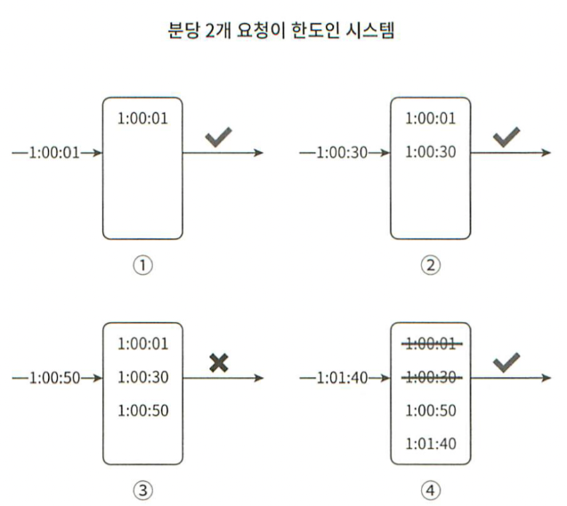
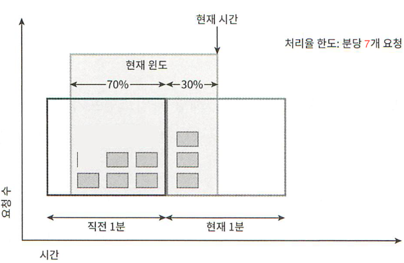
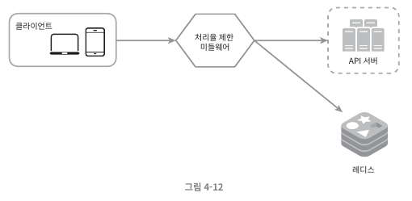
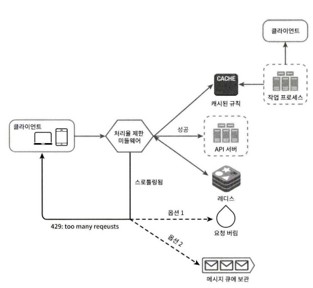
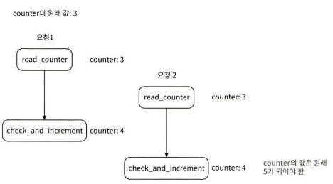
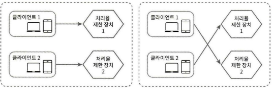
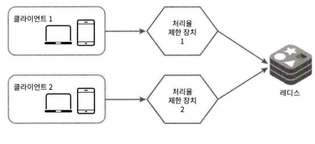

## 4장 처리율 제한 장치의 설계

처리율 제한 장치(rate limiter): 클라이언트 또는 서비스가 보내는 트래픽의 처리율을 제어하기 위한 장치다. HTTP를 예로 들면 이 장치는 특정 기간 내에 전송되는 클라이언트의 요청 횟수를 제한한다. API 요청 횟수가 제한 장치에 정의된 임계치를 넘어서면 추가로 도달한 모든 호출은 처리가 중단된다. 

### 1단계 문제 이해 및 설계 범위 확정

요구사항(기본적인 클라이언트-서버 통신 모델)

1. 설정된 처리율을 초과하는 요청은 정확하게 제한한다.
2. 낮은 응답시간: HTTP 응답시간에 나쁜 영향을 주어서는 곤란하다
3. 가능한 한 적은 메모리를 써야 한다.
4. 분산율 처리율 제한: 하나의 처리율 제한 장치를 여러 서버나 프로세스에 공유할 수 있어야 한다.
5. 예외 처리: 요청이 제한 되었을 때는 그 사실을 사용자에게 분명하게 보여줘야 한다.
6. 높은 결함 감내성: 제한 장치에 장애가 생기더라도 전체 시스템에 영향을 주면 안된다.
7. 서버 측 API를 위한 처리율 제한 장치이다.
8. 다양한 형태의 제어 규칙을 정의할 수 있도록 하는 유연한 시스템이어야 한다.
9. 대규모 요청을 처리할 수 있어야 한다.

- 설계 해보기
   
    **대략 적인 설계**
    
    1. 토큰 버킷 알고리즘 →1
    2. 토큰 버킷의 상태를 빠르게 접근하고 업데이트하기 위해 인메모리 데이터 저장소를 사용(레디스(REDIS)나 멤캐시드(Memcached) 같은 분산 캐시로 분산 처리)→2,3,4,9
    3. 요청이 제한되었을 때 사용자에게 명확한 메시지를 전달하기 위해 HTTP 상태 코드와 응답 본문을 활용→5
    4. 서킷 브레이커 패턴을 사용하여 처리율 제한 서비스의 장애를 감지하고, 장애 발생 시 대체 동작을 수행→6
    5. API 게이트웨이에서 처리율 제한 서비스와 통신하여 요청의 허용 여부를 판단(처리율 제한장치를  미들웨어에 두기)→7
    6. API 엔드포인트, 사용자, IP 주소 등 다양한 기준으로 처리율을 제한할 수 있는 유연한 규칙 시스템을 구현→8
    7. 수평적 확장을 통해 처리량을 높이고, 부하 분산 및 캐싱 기술을 활용하여 성능을 최적화
    - 레디스와 멤캐시드 비교
        
        [[Cache] Redis vs. Memcached](https://chrisjune-13837.medium.com/redis-vs-memcached-10e796ddd717)
        
        복잡한 제한 규칙을 표현하고 상태를 영속적으로 유지해야 하므로, **Redis가 더 적합**
        
        그치만 멤캐시드는 아래와 같은 장점이 있음
        
        - **단순한 키-값 저장소**: Memcached는 단순한 키-값 저장소로, 복잡한 데이터 구조가 필요하지 않은 경우에 적합합니다.
        - **높은 처리량**: Memcached는 메모리 기반 캐시로 Redis보다 더 높은 처리량을 제공합니다.
        - **간단한 운영 및 관리**: Memcached는 설정이 간단하고 운영 및 관리가 비교적 쉬움
        
        어차피 카운터값을 저장하는건데 단순한 멤캐시드가 낫지 않으려나? 잘 모르겠다
        
    - 서킷브레이커 패턴
        
        [[디자인패턴] 서킷 브레이커 패턴(Circuit Breaker Pattern)의 필요성 및 동작 원리](https://mangkyu.tistory.com/261)
        
        ```
        국내 대부분의 서비스들은 스프링 MVC 기반으로 되어있다. 스프링 MVC는 멀티 쓰레드 기반으로 동작하므로 장애가 있는 서비스를 호출하면 쓰레드 점유에 의한 응답 지연이 발생하기 쉽다. 그래서 장애가 전파되기 쉬운데, 서킷 브레이커를 사용하면 빠르게 장애가 발생한 서버로의 요청을 차단하고 이를 해결할 수 있다. 심지어 대안책을 적절히 마련한다면 정상적인 서비스 운영까지 가능하다. 물론 서킷 브레이커를 도입한다면 서킷 브레이커의 상태 및 히스토리 관리 등을 위한 추가 비용이 발생한다. 하지만 오늘날 서킷 브레이커는 안정적인 서비스 운영을 위한 필수 패턴이므로 반드시 적용해야 한다.
        ```
        
    
    ⇒토큰 버킷 알고리즘+레디스or멤캐시드+서킷브레이커패턴
    
    책에 나온 설계와 다르게 토큰 버킷 알고리즘+맴케시드로 처리율 제한 장치 설계
    
    서킷브레이커패턴은 성능과 별개로 장애 발생 시, 재처리or재시도 할 수 있으므로 예외적인 상황으로부터 복구 될수 있도록 하여 시스템의 안정성을 높일 수 있음
    
- 설계 비교하기 (내 설계A 🆚 책의 설계B)
    
    ### **처리율 제한 장치 A: 토큰 버킷 알고리즘과 멤캐시드**
    
    **토큰 버킷 알고리즘**
    설정된 처리율을 초과하는 요청은 효과적으로 제한
    
    요청은 토큰이 있을 때만 처리되며, 토큰은 일정 시간 간격으로 생성
    토큰의 생성과 소비가 일정하여 예측 가능한 트래픽 제어가 가능
    **멤캐시드 데이터 저장소**
    고속 캐싱 서비스로 메모리에 데이터를 저장하여 빠른 액세스가 가능
    대규모 분산 시스템에 적합하며, 여러 서버 간에 공유 가능
    
    ### 처리율 제한 장치 B: 이동 윈도 카운터 알고리즘과 레디스
    
    **이동 윈도 카운터 알고리즘**
    최근 시간 동안의 요청 수를 계산하여 처리율을 제한→ 시간 윈도 내에서의 요청 수를 통해 유연하게 제어
    높은 변동성의 트래픽에 효과적으로 대응가능
    **레디스 데이터 저장소**
    고성능 키-값 저장 데이터베이스로, 복잡한 데이터 구조를 메모리 내에 저장
    레디스의 내장 기능을 이용해 원자성을 보장하고, 실패에 대한 복원력이 높음
    
    ### 비교 및 추천
    
    1. 정확한 제한:
        - 토큰 버킷 알고리즘(A)은 버킷에 토큰을 미리 채워두고, 요청이 들어올 때마다 토큰을 소비하는 방식으로 정확한 처리율 제한이 가능
        - 이동윈도 카운터 알고리즘(B)은 일정 시간 동안의 요청 수를 카운트하여 제한하므로, 약간의 오차가 발생
        ⇒ 토큰 버킷 알고리즘(A)이 더 정확한 제한이 가능
    2. 메모리 사용: 
        - 멤캐시드는 간단한 데이터 구조를 빠르게 액세스하는 데 유리, 레디스(B)에 비해 적은 메모리를 사용
        - 레디스는 보다 복잡한 데이터 처리와 분산 처리에서 강점
            
            ⇒메모리 사용 최소화가 중요하다면 멤캐시드(A)가 유리
            
    3. 분산 처리: 
        - 레디스(B)는 분산 환경에서 사용하기에 적합한 데이터 저장소로, 여러 서버나 프로세스에서 공유 가능
        - 멤캐시드(A)도 분산 캐시로 사용 가능하지만, 레디스만큼 강력한 분산 기능을 제공X
            
            ⇒레디스(B)가 분산 처리 면에서 더 유리
            
    4. 응답 시간과 결함 감내성: 
        - 레디스는 멤캐시드에 비해 복잡한 연산이 가능하며, 내장된 내결함성 기능으로 서비스의 중단 없이 처리율 제한을 지속 가능
            
            ⇒레디스(B)가 유리
            
    5. 유연성과 대규모 요청 처리: 
        - 레디스(B)는 다양한 데이터 구조와 스크립팅, 트랜잭션 등의 고급 기능을 제공하여 보다 유연한 제어가 가능
        - 멤캐시드(A)도 대규모 요청 처리가 가능하지만, 레디스에 비해 확장성이 다소 낮음
        
        ⇒레디스(B)가 대규모 요청 처리 면에서 더 유리
        
    
    ### 결론
    
    토큰 버킷 알고리즘을 사용하는 처리율 제한 장치 A는 정확한 제한과 메모리 사용량 면에서 우수하지만, 분산 처리와 대규모 요청 처리 면에서는 이동윈도 카운터 알고리즘을 사용하는 처리율 제한 장치 B가 더 적합해 보입니다. 따라서 주어진 요구사항을 고려할 때, 레디스 데이터 저장소를 사용하는 이동윈도 카운터 알고리즘 기반의 처리율 제한 장치 B가 더 적합하다고 판단
    

**처리율 제한 장치는 어디에 둘 것인가?**

클라우드 마이크로서비스의 경우, 처리율 제한장치는 보통 API게이트웨이라 불리는 컴포넌트에 구현된다. 

- API 게이트웨이
    
    처리율 제한,  SSL 종단, 사용자 인증, IP허용목록 관리 등을 지원하는 완전 위탁관리형 서비스, 즉 클라우드 업체가 유지 보수를 담당하는 서비스다. 일단 여기서 API 게이트웨이가 처리율 제한을 지원하는 미들웨어라는 점만 기억하도록 하자. 
    

**처리율 제한 알고리즘**

- 토큰 버킷
    
    :토큰 버킷은 지정된 용량을 갖는 컨테이너로 이 버킷에는 사전 설정된 양의 토큰이 주기적으로 채워진다. 토큰이 꽉 찬 버킷에는 더 이상의 토큰은 추가 되지 않는다. 
    
    
    
    위 예제는 용량이 4인 버킷으로 이 버킷에는 매 분 4개의 버킷이 추가한다. 버킷이 가득차면 추가로 공급된 토큰은 버려진다(overflow)
    
    
    
    토큰 버킷 알고리즘은 2개 인자(parameter)를 받는다
    
    - 버킷 크기: 버킷에 담을 수 있는 토큰의 최대 개수
    - 토큰 공급률(refill rate): 초 당 몇개의 토큰이 버킷에 공급되는가
    
    버킷을 몇 개나 사용해야 하나? → 공급 제한 규칙에 따라 달라짐
    
    - 통상적으로, API 엔드 포인트마다 별도의 버킷을 둔다. (ex: 사용자 마다 하루에 한 번만 포스팅 가능, 친구는 150명까지 추가 가능, 좋아요 버튼은 5번만 누를 수 있음 ⇒ 사용자마다 3개의 버킷 둬야함)
    - IP 주소별로 처리율 제한을 적용해야 한다면 IP주소마다 버킷을 하나씩 할당
    - 시스템 처리율을 초당 10,000개 요청으로 제한하고 싶다면, 모든 요청이 하나의 버킷 공유
    
    장점
    
    - 구현이 쉬움
    - 메모리 사용 측면에서 효율적
    - 짧은 시간에 집중되는 트래픽도 처리가능, 버킷에 남은 토큰이 있기만 하면 요청은 시스템에 전달 될것임
    
    단점
    
    - 버킷 크기와 토큰 공급률이라는 두 개의 인자값을 적절하게 튜닝하는 게 까다로움
    
- 누출 버킷
    
    : 토큰 버킷 알고리즘과 비슷하지만 요청 처리율이 고정되어 있으며 보통 FIFO큐로 구현함
    
    
    
    누출 버킷 알고리즘의 인자
    
    - 버킷 크기: 큐 사이즈와 같은 값.  큐에는 처리될 항목들이 보관됨
    - 처리율(outflow rate): 지정된 시간당 몇 개의 항목을 처리할지 지정하는 값으로 보통 초 단위로 표현됨
    
    장점
    
    - 큐의 크기가 제한되어 있어 메모리 사용량 측면에서 효율적
    - 고정된 처리율을 갖고 있기 때문에 안정적 출력이 필요한 경우 적합함
    
    단점
    
    - 단시간에 많은 트래픽이 몰리는 경우 큐에는 오래된 요청들이 쌓이게 되고, 그 요청들을 제때 처리 못하면 최신 요청들은 버려지게 됨
    - 두 인자를 올바르게 튜닝하기가 까다로울 수 있음

- 고정 윈도 카운터
    
    
    
    타임라인을 고정된 간격의 윈도로 나누고, 각 윈도마다 카운터를 붙인다. 요청이 접수될 때마다 이 카운터의 값은 1씩 증가한다. 카운터의 값이 사전에 설정된 임계치에 도달하면 새로운 요청은 새 윈도가 열릴때가지 버려진다.
    
    장점
    
    - 메모리 효율이 좋다
    - 이해하기 쉽다
    - 윈도가 닫히는 시점에 카운터를 초기화하는 방식은 특정한 트래픽 패턴을 처리하기에 적합
    
    단점
    
    - 윈도의 경계 부근에 순간적으로 많은 트래픽이 집중될 경우 윈도에 할당된 양보다 더 많은 요청이 처리될 수도 있다

- 이동 윈도 로그
    
    : 고정윈도 카운터의 단점을 보완한 알고리즘
    
    요청이 오면 해당 요청의 타임스탬프를 추적함 (타임스탬프 데이터는 보통 레디스의 정렬집합 같은 캐시에 보관됨)→새 요청이 오면 만료된 타임스탬프는 제거(만료된 타임 스탬프: 그 값이 현재 윈도의 시작시점 보다 오래된 타임스탬프)→새 요청의 타임스탬프를 로그에 추가→로그의 크기가 허용치보다 같거나 작으면 요청을 시스템에 전달하고 크면 처리를 거부
    
    
    
    01,30 두 요청은 로그에 남고 허용되지만 50은 이미 요청 허용한도 초과로 로그에는 남지만 요청 거부됨. 이후 01:40에 온 요청때 이전 01,30은 만료된 타임스탬프라 로그에서 삭제되고 삭제 직후 로그 크기가 2로 갱신되므로 01:40의 신규요청은 로그에도 남고 실행도 됨
    
    장점
    
    - 처리율 제한 메커니즘이 아주 정교해 어느 순간의 윈도를 보더라도, 허용되는 요청의 개수는 시스템 처리율 한도를 넘지 않음
    
    단점
    
    - 거부된 요청의 타임스탬프도 보관하기 때문에 다량의 메모리를 사용함
    
- 이동 윈도 카운터
    
    :고정 윈도 카운터+이동 윈도 로깅을 결합한 형태로 두가지 접근법이 사용될 수 있음(일단 하나만 설명)
    
    
    
    처리율 제한 장치의 한도가 분당 7개 요청으로 설정. 이전 1분 동안 5개의 요청이, 그리고 현재 1분 동안 3개의 요청이 옴
    
    현재 1분의 30%시점에 도착한 새 요청의 경우, 현재 윈도에 몇개의 요청이 온것으로 보고 처리해야 하는가?
    
    →현재 1분간의 요청 수 + 직전 1분간의 요청 수X 이동 윈도와 직전 1분이 겹치는 비율
    
    3+5*70%=6.5개
    
    내림으로 6개라 보고 처리율 한도는 7개까지이므로 현재 1분의 30%시점에 도착한 신규 요청은 시스템으로 전달됨
    
    - 이동윈도 카운터 접근법 나머지 하나에 관한 참고글
        
        [System Design — Rate limiter and Data modelling](https://medium.com/@saisandeepmopuri/system-design-rate-limiter-and-data-modelling-9304b0d18250)
        
    
    장점
    
    - 이전 시간대의 평균 처리율에 따라 현재 윈도의 상태를 계산하므로 짧은 시간에 몰리는 트래픽에도 잘 대응함
    - 메모리 효율이 좋음
    
    단점
    
    - 직전 시간대에 도착한 요청이 균등하게 분포되어 있다고 가정한 상태에서 추정치를 계산하므로 다소 느슨함(근데 그렇게 심각한 문제는 아님)

**개략적인 아키텍처**

처리율 제한 알고리즘의 기본 아이디어는 단순하다. 얼마나 많은 요청이 접수되었는지를 추적할 수 있는 카운터를 추적 대상별로 두고 이 카운터의 값이 어떤 한도를 넘어서면 한도를 넘어 도착한 요청은 거부하는 것이다.

그렇다면 이 카운터는 어디에 보관될 것인가? 메모리상에서 동작하는 캐시가 바람직한데, 빠른데다 시간에 기반한 만료정책을 지원하기 때문이다.

- 레디스(Redis)
    
    : 처리율 제한 장치를 구현할 때 자주 사용되는 메모리 기반 저장장치로서, INCR과 EXPIRE 두가지 명령어를 지원함
    
    - INCR: 메모리의 저장된 카운터의 값을 1만큼 증가시킴
    - EXPIRE: 카운터에 타임아웃 값을 설정한다. 설정된 시간이 지나면 카운터는 자동으로 삭제됨
    
    
    
    클라이언트가 처리율 제한 미들웨어에게 요청 보냄→ 처리율 제한 미들웨어는 레디스의 지정 버킷에서 카운터를 가져와서 한도에 도달했는지 아닌지를 검사(도달하면 요청 거부, 한도 미만이면 요청은 API 서버로 전달)→미들웨어는 카운터의 값을 증가시킨 후 다시 레디스에 저장됨
    

**상세 설계**



- 처리율 제한 규칙은 디스크에 보관한다. 작업 프로세스는 수시로 규칙을 디스크에서 읽어 캐시에 저장한다.
- 클라이언트가 요청을 서버에 보내면 요청은 먼저 처리율 제한 미들웨어 도달한다.
- 처리율 제한 미들웨어는 제한 규칙을 캐시에서 가져온다. 아울러 카운터 및 마지막 요청의 타임스탬프를 레디스 캐시에서 가져온다. 가져온 값들에 근거하여 해당 미들웨어는 다음과 같은 결정을 내린다.
    - 해당 요청이 처리율 제한에 걸리지 않은 경우에는 API서버로 보낸다.
    - 해당 요청이 처리율 제한에 걸렸다면 429 too many requests 에러를 클라이언트에 보낸다. 한편 해당 요청은 그대로 버릴 수도 있고 메시지 큐에 보관할 수도 있다.

**분산환경에서의 처리율 제한 장치의 구현**

단일 서버를 지원하는 처리율 제한 장치를 구현하는 것은 어렵지 않다. 하지만 여러대의 서버와 병렬 스레드를 지원하도록 시스템을 확장하는 것은 또다른 문제다. 다음 두 가지 어려운 문제를 풀어야 한다.

- 경쟁 조건
    
    
    레디스에 저장된 변수 counter의 값이 3이라고 하자. 그리고 두 개 요청을 처리하는 스레드가 각각 병렬로 counter 값을 읽었으며 그 둘 가운데 어느 쪽도 아직 변경된 값을 저장하지는 않은 상태라 해 보자. 둘 다 다른 요청의 처리 상태는 상관하지 않고 counter에 1을 더한 값을 레디스에 기록할 것이다. 그리고 counter의 값을 올바르게 바꼈다고 판단했겠지만 그림과 같이 counter의 값은 5가 아닌 4가 된다.
    
    경쟁 조건 문제를 해결하는 가장 널리 알려진 해결책은 락(lock)이다. 하지만 락은 시스템의 성능을 상당히 떨어뜨린다는 문제가 있다. 위 설계의 경우에는 락 대신  루아스크립트와 정렬집합이라는 불리는 레디스 자료구조이다.
    
    - 루아 스크립트와 레디스 자료구조
        - 루아 스크립트: 절차지향적 선언형 언어라고 하는데 아마 순차적으로 실행시켜서 경쟁을 없앤다는 느낌
        - 레디스 정렬집합: 모든 레디스 작업을 MULTI 명령을 사용하여 원자적 작업으로 수행할 수 있다. 즉, 두 개의 프로세스가 동일한 사용자에 대해 작업을 시도할 때 최신 정보가 아닌 상태가 될 수 없으므로 경쟁 조건 문제를 방지한다.
        
        • 루아 스크립트는 서버 측에서 실행되므로, 여러 클라이언트가 동시에 요청을 보내더라도 서버에서 하나의 스크립트가 실행되고 해당 스크립트의 실행이 끝날 때까지 다른 요청을 처리하지 않습니다.
        • 정렬된 집합의 연산은 원자적으로 수행되므로, 동시에 여러 클라이언트가 동일한 집합에 대해 연산을 수행해도 중간 상태가 발생하지 않습니다.
        
- 동기화 이슈
    
    동기화는 분산 호나경에서 고려해야 할 또 다른 중요한 요소다. 수백만 사용자를 지원하려면 한대의 처리율 제한 장지 서버로는 충분하지 않을 수 있다. 그래서 처리율 제한 장치서버를 여러 대 두게 되면 동기화가 필요해진다. 동기화를 하지 않는다면 처리율 제한을 올바르게 수행할 수 없을 것이다. 
    
    
    
    이를 위한 해결책은 고정 세션(Sticky Session)을 활용하여 같은 클라이언트로부터의 요청은 항상 같은 처리율 제한 장치로 보낼 수 있도록 하는 것이다. 
    
    but, 규모면에서 확장 가능하지도 않고 유연하지도 않아 비추천
    
    →레디스와 같은 중앙 집중형 데이터 저장소 사용하기
    
    
    
- 성능 최적화
    - 여러 데이터 센터중 사용자의 트래픽을 가장 가까운 에지서버로 전달하여 지연 시간 줄임
    - 제한 장치간에 데이터를 동기화할 때 최종일관성 모델을 사용(6장 참고)
- 모니터링
    
    이벤트 때문에 트래픽이 급증할 때 처리율 제한 장치가 비효율적으로 동작한다면, 그런 트래픽 패턴을 잘 처리할 수 있도록 알고리즘을 바꾸는 것을 생각해봐야함→토큰버킷이 적합
    

### 4단계: 마무리

- 경성 또는 연성 처리율 제한
    - 경성 처리율 제한: 요청의 개수는 임계치를 절대 넘어 설 수 없다.
    - 연성 처리율 제한: 요청의 개수는 잠시 동안은 임계치를 넘어설 수 있다.
- 다양한 계층에서의 처리율 제한
    - 이번 장에서는 애플리케이션 계층(7번 계층)에서의 처리율 제한에 대해서만 살펴봤지만 다른 계층에서도 처리율 제한이 가능함
    - 처리율 제한을 회피하는 방법⇒클라이언트를 어떻게 설계하는 것이 최선인가?
        - 클라이언트 측 캐시를 사용하여 API 호출 횟수를 줄인다
        - 처리율 제한의 임계치를 이해하고, 짧은 시간동안 너무 많은 메시지를 보내지 않도록 한다.
        - 예외나 에러를 처리하는 코드를 도입하여 클라이언트가 예외적인 상황으로부터 복구 될 수 있도록 한다
        - 재시도 로직을 구현할 때는 충분한 백오프 시간을 갖는다.