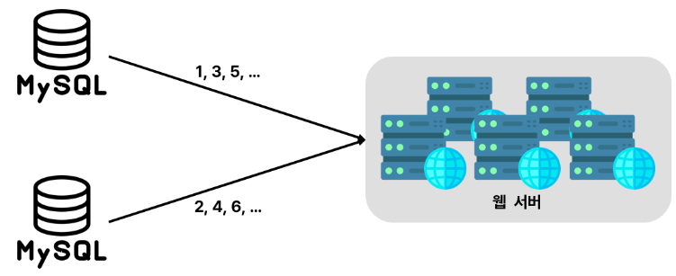
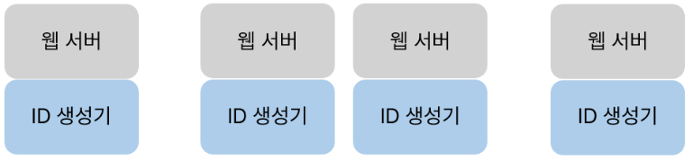
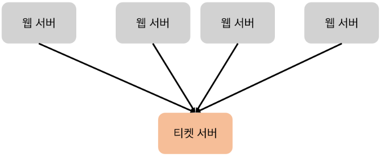
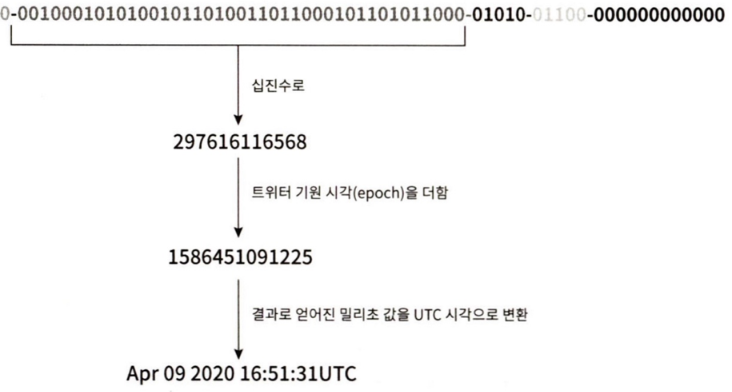

## 7장  분산 시스템을 위한 유일 ID생성기 설계

`auto_increment` 속성이 설정된 관계형데이터베이스의 기본 키를  쓰면 되지 않을까?

➡️데이터베이스 서버 한대로는 요구를 감당할 수 없을 뿐더러, 여러 데이터 베이스 서버를 쓰는 경우에는 지연시간(delay)을 낮추기가 무척 힘들 것이기 때문에 분산 환경에선 이 접근법이 통하지 않음

### 1단계 문제 이해 및 설계 범위 확정

- ID는 유일해야 한다
- ID는 숫자로만 구성되어야 한다
- ID는 64비트로 표현될 수 있는 값이어야 한다
- ID는 발급 날짜에 따라 정렬 가능해야한다
- 초당 10,000개의 ID를 만들 수 있어야 한다

### 2단계 개략적 설계안 제시 및 동의 구하기

**다중 마스터 복제**

데이터베이스의 `auto_increment` 기능을 활용하는 것이다. 다만 다음 ID 값을 구할 때 1만큼 증가시켜 얻는 것이 아니라, k(현재 사용 중인 데이터베이스의 서버의 수)만큼 증가시킨다.

어떤 서버가 만들어 낸 다음 아이디는, 해당 서버가 생성한 이전 ID 값에 전체 서버의 수(여기서는 2)를 더한 값이다. 이렇게 하면 규모 확장성 문제를 어느 정도 해결할 수 있는데, 데이터베이스 수를 늘리면 초당 생산 가능 ID 수도 늘릴 수 있기 때문이다.

단점

- 여러 데이터 센터에 걸쳐 규모를 늘리기 어렵다
- ID의 유일성은 보장되겠지만 그 값이 시간 흐름에 맞추어 커지도록 보장할 수는 없다
- 서버를 추가하거나 삭제할 때도 잘 동작하도록 만들기 어렵다

**UUID**

컴퓨터 시스템에 저장되는 정보를 유일하게 식별하기 위한 128비트짜리 수로 충돌 가능성이 지극히 낮다. (*"중복 UUID가 1개 생길 확률을 50%로 끌어 올리려면 초당 10억 개의 UUID를 100년 동안 계속해서 만들어야 한다.")*

각 웹 서버는 별도의 ID 생성기를 사용해 독립적으로 ID를 만들어 낸다.

장점

- UUID를 만드는것이 단순. 서버 사이의 조율이 필요 없으므로 동기화 이슈도 없음
- 각 서버가 자기가 쓸 ID를 알아서 만드는 구조이므로 규모 확장도 쉬움

단점

- ID가 128비트로 길다→요구사항에서는 64비트를 요구하므로 탈락
- ID를 시간 순으로 정렬 할 수 없다 →요구사항에서 발급날짜 순으로 정렬해야 되서 탈락
- ID에 숫자가 아닌 값이 포함 될 수 있다 → 요구사항에서 ID는 숫자로 구성되어야 해서 탈락

**티켓서버**

auto_increment 기능을 갖춘 데이터베이스 서버가 티켓서버가 되어 이를 중앙집중형으로 하나만 사용하는 것이다.

장점

- 유일성이 보장되는 오직 숫자로만 구성된 ID를 쉽게 만들 수 있다
- 구현하기 쉽고, 중소 규모 애플리케이션에 적합

단점

- 티켓 서버가 SPOF(Single-Point-of-Failure)가 된다. 이 서버에 장애가 발생하면, 해당 서버를 이용하는 모든 시스템이 영향을 받는다. 이 이슈를 피하고자 티켓 서버를 여러 대 준비해야 하면 데이터 동기화 같은 새로운 문제가 발생

**트위터 스노우플레이크 접근법**

앞서 나온 여러 ID생성기 구현 방법으로는 요구사항을 충족시키지 못함→우선, 요구사항을 충족시킬 64비트의 ID 구조 살펴보기

요구사항을 충족시킬 64비트의 ID 구조 

- 사인(sign) 비트: 1비트를 할당한다. 지금으로서는 쓰임새가 없지만 나중을 위해 유보해 둔다. 음수를 양수를 구별하는 데 사용할 수 있을 것이다.
- 타임스탬프(timestamp): 41비트를 할당한다. 기원 시각(epoch) 이후로 몇 밀리초가 경과했는지를 나타내는 값이다.
- 데이터 센터 ID: 5비트를 할당한다. 따라서 2^5=32개 데이터센터를 지원할 수 있다.
- 서버 ID: 5비트를 할당한다. 따라서 데이터센터당 32개 서버를 사용할 수 있다.
- 일련번호: 12비트를 할당한다. 각 서버에서는 ID를 생성할 때마다 이 일련번호를 1만큼 증가시킨다. 이 값은 1밀리초가 경과할 때마다 0으로 초기화(reset)된다.

### 3단계 상세 설계

데이터 센터 ID, 서버ID는 시스템이 시작할 때 결정되며, 일반적으로 시스템 운영 중에는 바꾸지 않음

but, 데이터센터 ID나 서버 ID를 잘못 변경하게 되면 ID충돌이 발생할 수 있어, 신중하게 작업 진행

타임 스탬프나 일련번호는 ID 생성기가 돌고 있는 중에 만들어지는 값임

**타임 스탬프**

타임 스탬프는 시간에 흐름에 따라 점점 큰 값을 갖게 되므로, 결국 ID는 시간순으로 정렬 가능

이진표현 형태로부터 UTC시각을 추출하는 예제

41비트로 표현 할 수 있는 타임스탬프의 최대값은 2^41−1=2199023255551 밀리초이다. (약 69년)

➡️이 ID생성기는 69년동안만 정상 동작. 69년이 지나면 기원 시각을 바꾸거나 ID체계를 다른 것으로 이전해야 함

**일련번호**

일련번호는 12비트 이므로 2^12 = 4096개의 값을 가질 수 있다. 어떤 서버가 같은 밀리초 동안 하나 이상의 ID를 만들어 낸 경우에만 0보다 큰 값을 갖게 된다. 

➡️두 개 이상의 일련번호가 동일한 시간에 생성된 경우 0보다 큰 값을 가진다.

### 4단계 마무리

모든 요구사항을 만족하는 방식은 스노플레이크 방식으로 분산 환경에서 규모 확장이 가능함

추가로 논의할 수 있는 사항

- 시계 동기화(clock synchronization) : 이번 설계를 진행하면서 우리는 ID 생성 서버들이 전부 같은 시계를 사용한다고 가정하였다. 하지만 이런 가정은 하나의 서버가 여러 코어에서 실행될 경우 유효하지 않을 수 있다. 여러 서버가 물리적으로 독립된 여러 장비에서 실행되는 경우에도 마찬가지다. NTP(Network Time Protocol)는 이 문제를 해결하는 가장 보편적 수단.
- 각 섹션의 길이 최적화 : 예를 들어 동시성이 낮고 수명이 긴 애플리케이션이라면 일련번호 절의 길이를 줄이고 타임스탬프 절의 길이를 늘리는 것이 효과적일 수 있다.
- 고가용성(high availability) : ID 생성기는 필수 불가결(mission critical) 컴포넌트 이므로 아주 높은 가용성을 제공해야 할 것이다.