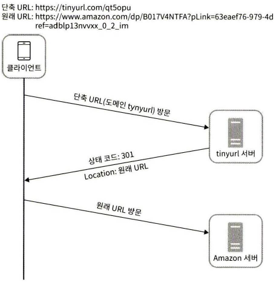
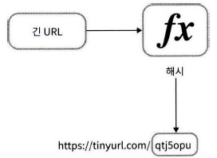
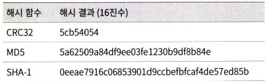
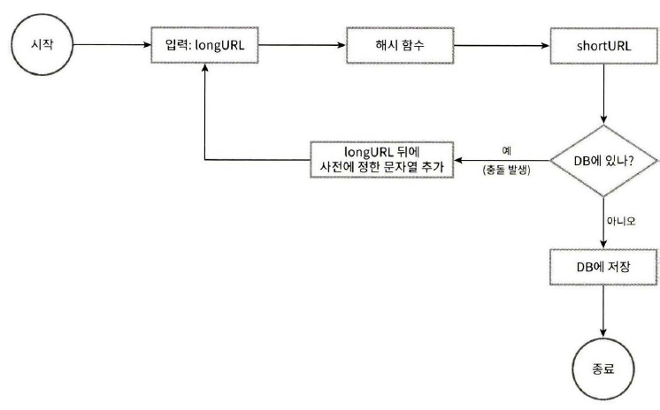
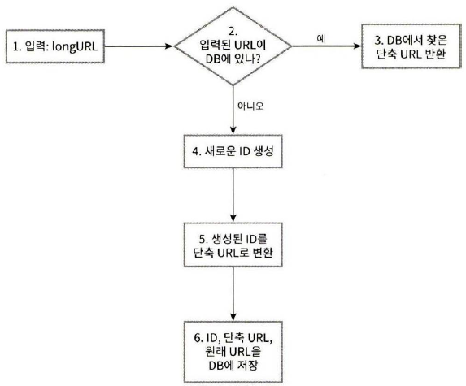

## 8장 URL 단축기 설계

### 1단계 문제 이해 및 설계 범위 확정

- 단축 URL에는 숫자(0~9)와 영문자(a~Z)만 사용가능
- URL 단축: 주어진 긴 URL을 훨씬 짧게 줄인다
- URL 리디렉션(redirection): 축약된 URL로 HTTP요청이 오면 원래 URL로 안내
- 높은 가용성과 규모 확장성, 그리고 장애 감내 요구
- 쓰기 연산: 매일 1억개의 단축 URL생성
- 초당 쓰기 연산: 1억/24/3600=1,160개
- 읽기 연산: 읽기 연산과 쓰기 연산 비율 10:1로 잡으면 읽기 연산은 초당 11,600회
- URL단축 서비스를 10년간 운영한다고 가정 시, 1억x365x10=3650억개의 레코드를 보관
- 축약전 URL의 평균 길이는 100으로 가정
- 위의 결과 10년 동안 필요한 저장 용량은 3650억x100바이트=36.5TB이다.

### 2단계: 개략적 설계안 제시 및 동의 구하기

**API 엔드 포인트**

REST 스타일로 설계→아래의 엔드 포인트를 필요로 함

1. URL 단축용 엔드 포인트: 새 단축 URL을 생성하고자 하는 클라이언트는 이 엔드 포인트에 단축할 URL을 인자로 실어서 POST요청을 보냄
    
    ```
    POST/api/v1/data/shorten
    * 인자: {longUrl: longURLstring}
    * 반환: 단축 URL
    ```
    
2. URL 리디렉션용 엔드 포인트: 단축 URL에 대해서 HTTP 요청이 오면 원래 URL로 보내주기 위한 용도의 엔드포인트
    
    ```
    GET/api/v1/shortUrl
    * 반환: HTTP 리디렉션 목적지가 될 원래 URL
    ```
    

**URL 리디렉션**



클라이언트와 서버 사이의 통신 절차

301응답과 302 응답의 차이

- `301 Permanently Moved`: 해당 uURL에 대한 HTTP 요청의 처리 책임이 영구적으로 Location헤더에 반환된 URL로 이전되었다는 응답. 영구적으로 이전되었으므로, 브라우저는 이 응답을 캐시(cache)함
    
    ➡️추후 같은 단축 URL에 요청을 보낼 필요가 있을 때 브라우저는 캐시된 원래 URL로 요청을 보내게 됨
    
    - 장점: 첫번째 요청만 단축 URL서버로 전송되기 때문에 서버 부하가 줄어듦
    - 단점: 트래픽 분석이 안됨
- `302 Found` : 주어진 URL로의 요청이 ‘일시적으로’ Location헤더가 지정하는 URL에 의해 처리되어야 한다는 응답
    
    ➡️클라이언트의 요청은 언제나 단축 URL 서버에 먼저 보내진 후에 원래 URL로 리디렉션 됨
    
    - 장점: 클릭 발생률이나 발생위치를 추적하는데 더 유리
    - 단점: 301보다 서버 부하가 큼

URL 리디렉션을 구현하는 가장 직관적인 방법은 해시 테이블을 사용하는 것. 해시 테이블에 <단축 URL, 원래 URL>의 쌍을 저장한다고 가정하면 아래와 같이 URL 리디렉션이 구현됨 (뒤에 가면 해시테이블 말고 다른 방식으로 해야 됨)

- 원래 URL: `hashTable.get(단축 URL)`
- 301또는 302응답 Location헤더에 원래 URL을 넣은 후 전송

**URL 단축**

단축 URL이 www.tinyurl/{hashValue} 같은 형태라고 해 보자. 결국 중요한 것은 긴 URL을 이 해시 값으로 대응시킬 해시 함수 `fx`를 찾는 일이 될 것



해시 함수가 만족해야 할 요구 사항

- 입력으로 주어지는 긴 URL이 다른 값이면 해시 값도 달라야 한다
- 계산된 해시 값은 원래 입력으로 주어졌던 긴 URL로 복원될 수 있어야 한다

### 3단계 상세설계

**데이터 모델**

앞서 개략적인 설계를 진행할때는 모든 것을 해시 테이블에 두었음. 그렇지만 메모리는 유한하고 비싸기 때문에 이 접근법은 실제 시스템에서 쓰기 곤란함.

➡️<단축 URL, 원래 URL>의 순서쌍을 관계형 데이터베이스에 저장하는 게 더 나음. 테이블에 id, shortURL, longURL 이 3개의 컬럼이 포함되어야 함

**해시 함수**

해시 함수는 원래 URL을 단축 URL로 변환할 때 쓰임. 아래 편의상 해시 함수가 계산하는 단축 URL값을 hashValue로 지칭

- 해시 값의 길이: hashValue는 [0-9, a-z, A-Z]의 문자로 구성되므로 사용 가능한 문자는 총 62개. hashValue의 길이는 62^n ≥ 3650억인 n의 최소값=7 이므로 hashValue길이는 7
- 해시 후 충돌 해소: 예시로 'https:/en.wikipedia.org/wiki/Systems_design'를 아래의 잘 알려진 해시 함수이용 ⇒ hashValue가 모두 7자리가 넘는 문제
    
    
    
    ➡️hashValue에서 처음 7개의 글자만 이용(→해시 결과가 서로 충돌할 확률이 높아짐)
    
    👉충돌이 실제로 발생했을 때는, 충돌이 해소 될때까지 사전에 정한 문자열을 해시 값에+
    
    
    
    - 블룸필터
        
        어떤 집합에 특정 원소가 있는지 검사할 수 있도록하는 , 확률론에 기초한 공간 효율이 좋은 기술
        
- base-62 변환:  62자로 이루어진 인코딩 체계로 62진법으로 수를 표현 ex) 10진수로 `11157`을 62진법으로 변환한다면 `2TX`


두 접근법 비교

**URL 단축기 상세 설계**



1. 입력으로 긴 URL을 받는다.
2. 데이터베이스에 해당 URL이 있는지 검사한다.
3. 데이터베이스에 있다면 해당 URL에 대한 단축 URL을 만든 적이 있는 것이다. 따라서 데이터베이스에서 해당 단축 URL을 가져와서 클라이언트에게 반환한다.
4. 데이터베이스에 없는 경우에는 해당 URL은 새로 접수된 것이므로 유일한 ID를 생성한다. 이 ID는 데이터베이스의 기본 키로 사용된다.
5. 62진법 변환을 적용하여 ID를 단축 URL로 만든다.
6. ID, 단축 URL, 원래 URL로 새 데이터베이스 레코드를 만든 후 단축 URL을 클라이언트에게 전달한다.

🪧예시

- 입력된 URL(원래 URL): https://en.wikipedia.org/wiki/Systems_design
- 위 URL에 대해 ID생성기가 반환한 ID: 2009215674938
- 위 ID를 62진수로 변환한 값: zn9edcu
    
    
    | ID | shortURL | longURL |
    | --- | --- | --- |
    | 2009215674938 | zn9edcu | https://en.wikipedia.org/wiki/Systems_design |

**URL 리디렉션 상세 설계**


1. 사용자가 단축 URL을 클릭한다.
2. 로드밸런서가 해당 클릭으로 발생한 요청을 웹 서버에 전달한다.
3. 단축 URL이 이미 캐시에 있는 경우에는 원래 URL을 바로 꺼내서 클라이언트에게 전달한다.
4. 캐시에 해당 단축 URL이 없는 경우에는 데이터베이스에서 꺼낸다. 데이터베이스에 없다면 아마 사용자가 잘못된 단축 URL을 입력한 경우일 것이다.
5. 데이터베이스에서 꺼낸 URL을 캐시에 넣은 후 사용자에게 반환한다.

### 4단계 마무리

추가로 고민해 볼 사항

- 처리율 제한 장치(rate limiter): 지금까지 살펴본 시스템은 엄청난 양의 URL 단축 요청이 있을 경우 무력화될 수 있다는 잠재적 보안 결함을 갖고 있다. 처리율 제한 장치를 두면, IP 주소를 비롯한 필터링 규칙들을 이용해 요청을 걸러낼 수 있을 것이다.
- 웹 서버의 규모 확장: 본 설계에 포함된 웹 계층은 무상태 계층이므로, 웹 서버를 자유롭게 증설하거나 삭제할 수 있다.
- 데이터베이스의 규모 확장: 데이터베이스를 다중화하거나 샤딩(sharding)하여 규모 확장성을 달성할 수 있다.
- 데이터 분석 솔루션(analytics): 성공적인 비즈니스를 위해서는 데이터가 중요하다. URL 단축기에 데이터 분석 솔루션을 통합해 두면 어떤 링크를 얼마나 많은 사용자가 클릭했는지, 언제 주로 클릭했는지 등 중요한 정보를 알아낼 수 있을 것이다.
- 가용성, 데이터 일관성, 안정성: 대규모 시스템이 성공적으로 운영되기 위해서는 반드시 갖추어야 할 속성들이다.