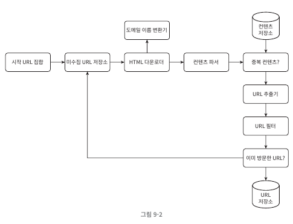

# 웹 크롤러 설계
## 개략적 설계안

## Graph 자료구조
페이지는 노드, 하이퍼링크는 엣지라고 볼 수 있기에 그래프 자료구조가 적합하다.  
또한 이를 탐색하는 방식으로 BFS가 적합하다. DFS는 그래프가 얼마나 깊을지 모르기에 부적합하다.
### BFS 알고리즘
**원리**  
  1. 시작 노드를 큐에 넣는다.
  2. 시작 노드를 큐에서 꺼낸 후, 해당 노드에 방문 표시를 하고 인접 노드를 큐에 넣는다. 단 이미 방문한 노드는 큐에 넣지 않는다.
  3. 큐가 빌 때까지 2번을 반복한다.
**유의 사항**
- 그래프 탐색을 병렬적으로 하게되면 같은 호스트 서버에 동시에 여러 요청을 가하는 예의 없는 크롤링을 유발할 수 있다.
- 표준 BFS 는 URL 간 우선순위를 두지 않는다.

## 미수집 URL 저장소
URL 의 우선순위 관련 정보를 저장하고 예의 있는(한 번에 한 페이지만 요청하는) 크롤러를 구현할 수 있다.
### 우선 순위 반영
- 순위 결정장치: 입력된 URL의 우선순위를 배정하고 우선순위에 따른 큐에 URL을 할당하는 역할
- 전면 큐 선택기: 순위가 높은 큐에서 더 자주 꺼내는 역할
### 예의
- 후면 큐 라우터: 같은 호소트에 속한 URL이 언제나 같은 큐로 라우팅되도록 하는 역할
- 매핑 테이블: 호스트 이름과 큐 사이의 매핑을 저장하는 테이블
- 후면 큐 선택기: 서로 다른 호스트의 큐에서 나온 URL을 작업 스레드에 전달하는 역할
- 작업 스레드: 전달된 URL을 순차적으로 다운로드 하는 역할.

## HTML 다운로더
### 성능 최적화
1. 분산 크롤링
2. DNS Resolver
   - DNS 요청의 동기적 특성 상 병목 지점에 해당.
   - 따라서 미리 DNS와 ip를 cronjob으로 캐싱해두는 방법이 있음.
3. 지역성: 크롤러 분산 시 지역적으로 가까운 곳에 배치하는 것.
4. 짧은 타임아웃

### 안정성
1. 부하 분산 시 안정 해시 설계 적용
2. 로깅, 예외 처리, 데이터 검증

### 확장성
### 문제 있는 콘텐츠 감지 및 회피
1. 중복 컨텐츠: 해시, **체크섬**을 이용한 탐지
2. 거미 덫
크롤러를 무한 루프에 빠뜨리는 페이지(거미 덫)를 회피하기 위해서 URL 최대 길이를 제한하거나 수작업으로 URL 필터에 등록하는 수 밖에 없다.
덫을 피하는 알고리즘을 만들기 까다롭기 때문이다.
3. 데이터 노이즈: 이 또한 수작업으로 필터링 해야 한다.